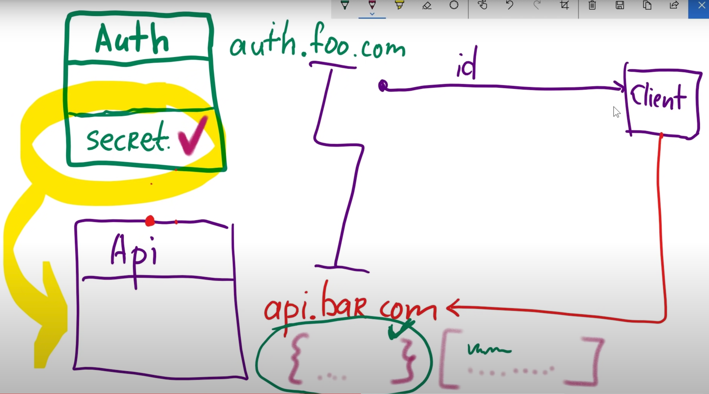

= JSON Web Token
source https://www.youtube.com/playlist?list=PLvTBThJr861y60LQrUGpJNPu3Nt2EeQsP
:toc:

== Теория

JWT решает проблему проверки достоверности пользователя проверяя это расшифровыванием секретного ключа.
JWT состоит из трех частей: заголовок header, полезные данные payload и подпись signature.

Хедер JWT содержит информацию о том, как должна вычисляться JWT подпись.

header = { "alg": "HS256", "typ": "JWT"}

Payload — это полезные данные, которые хранятся внутри JWT.

payload = { "userId": "b08f86af-35da-48f2-8fab-cef3904660bd" }

Signature  - это подпись достоверности данных и то что должно быть секретно

== Проблемы

== Сервер

== Клиент

